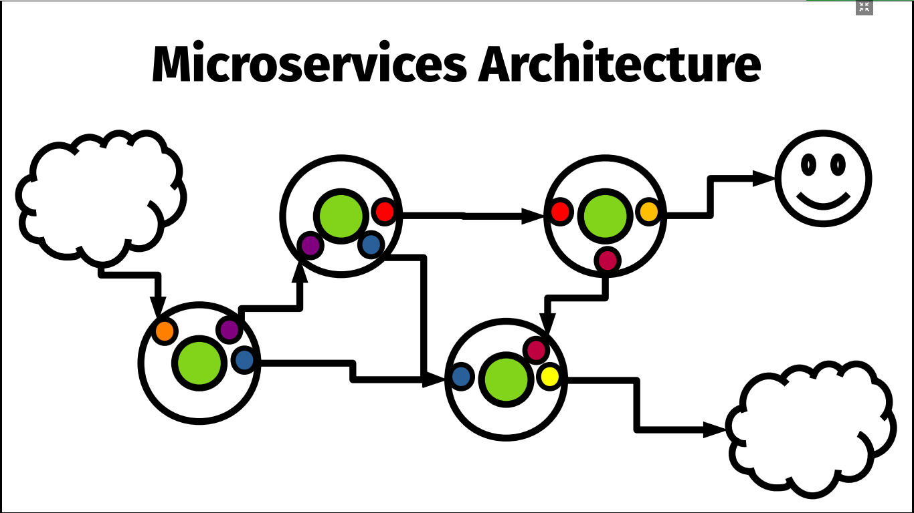

# My notes on [Microservices: A developer's point of view](https://youtu.be/2uWvRFO0vW8) by Uberto Barbini
In this talk [Uberto Barbini](https://twitter.com/ramtop) describes the microservice architecture that was created at Springer Nature.

They use [Clud Foundry](https://www.cloudfoundry.org/application-runtime/) to have an architecture that can be easily moved between different cloud providers (and they actually already did a vendor change). 

They created microservices that communicate via HTTP.

In the above picture each big withe circle is a microservice, green circles represent the domain code, that is possibly duplicated between services, while the coloured circles are the adapters, i.e. pieces of software that handle communication between services.  

### Code organization
They use a single Git repository where they split the codebase in modules:
* Underware (Utils) 
* Domain (it depends just on utils)
* Adapters (connection to other microservices or external services like SparkPost; they depend on Domain, no dependencies between adapters - If you need links to other adapters you must use interfaces and callbacks)
* Executable (it composes domains and adapter in a microservice)

### Advantages of this microservices architecture
* You can scale the services that are more used
* You can find bugs more easily, since they are usually located in one microservice, and you have more fine-grained logs to spot the error.
* You can deploy just a smaller part of the application

### Drawbacks
* Some business logic is duplicated between different machines, so you could have a memory and resource overhead.
* The architecture is more complicated (IMHO).
* The HTTP communication between services introduces a small delay, so it could be not suited for applications that must have very fast response times.

## Miscellaneous notes
### Use Architectural Decision Record
For each architectural decision write a small document that records when, who and why this decision was made.

### A good idea from Nat Pryce
Why don't we organize meetings with TDD? We should declare before starting a meeting which are the results we want from it to tell it was successfully.
