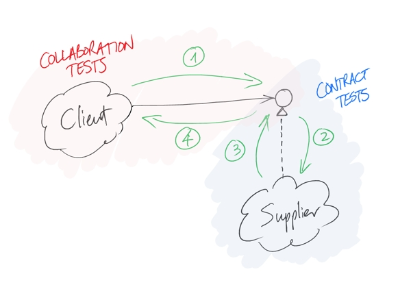

# My notes on [J.B. Rainsberger - Integrated Tests Are A Scam](http://vimeo.com/80533536) by J.B. Rainsberger

### Why do we write Integrated Tests (IT)?
We write integrated test because in some systems there are lots of Unit Tests that checks each single part, 
but there are still bugs due to errors when these parts communicate between them.  

### Why Integrated Test are scams? 
* They don't put pressure on our design. Usually writing more IT means writing less Unit Tests (UT) that instead keep our design clean. That leads to more bugs, that need more IT to be fixed.
* To write effective IT, we should test al the paths that our software can follow. 
If module A that has 2 paths (e.g. a simple `IF`) talks to module B that has 3 paths (e.g. a `SWITCH`), we should write 2 * 3 IT, one for each possible path.
The number of tests grows as a factorial function of the number of paths.
* IT are slow, because we should set up a lot of things (and these things are usually slower than simple memory access).
* IT are britten, since they depend on so many parts. 

## So how could we solve this problem?
First of all we should always program toward interfaces: two different part of the system should interact each other using an interface that states a contract between them.
This way we could write UT that certify the [fulfilling of this contract](https://online-training.jbrains.ca/courses/the-jbrains-experience/lectures/5600334).
 

1) The client asks the supplier questions. (Client uses interface syntax.)
2) The supplier “accepts” those questions. (Supplier implements interface syntax.)
3) The supplier answers those questions. (Supplier implements interface semantics.)
4) The client “can understand” the answers. (Client uses interface semantics.)
